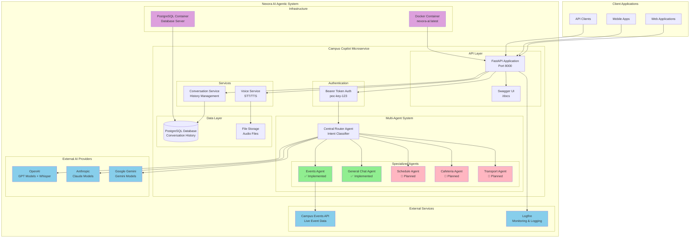
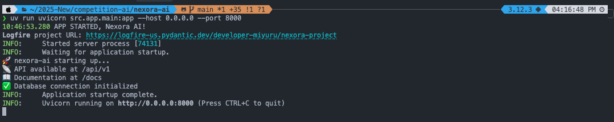

# Nexora AI

## Project Overview

This repository contains the **Campus Copilot Microservice**, a core component of the larger **Nexora AI Agentic System**. This FastAPI-based microservice implements a multi-agent architecture that provides intelligent assistance for university students through specialized AI agents handling different aspects of campus life including events, schedules, dining, transportation, and general inquiries. The microservice uses PydanticAI for agent orchestration and supports multiple AI providers (OpenAI, Anthropic, Gemini), serving as one of the intelligent backend services within the complete Nexora AI ecosystem.

## Features

### Core Features

- **Multi-Agent Architecture**: Intelligent routing system with specialized agents for different campus services
- **Voice Processing**: Speech-to-text and text-to-speech capabilities using OpenAI Whisper and gTTS
- **Real-time Event Information**: Live campus events data integration and search
- **Conversation Management**: Persistent conversation history with PostgreSQL database
- **RESTful API**: FastAPI-based endpoints for chat, voice, and conversation management
- **Intent Classification**: Smart routing of user queries to appropriate specialized agents

### Additional Features

- **Multiple AI Provider Support**: Compatible with OpenAI, Anthropic, and Google Gemini APIs
- **Docker Deployment**: Full containerization with Docker Compose setup
- **Database Migration**: Alembic integration for database schema management
- **Comprehensive Logging**: Logfire integration for monitoring and debugging
- **Authentication**: Bearer token-based API security
- **Cross-Origin Support**: CORS middleware for web integration
- **Audio Processing**: Support for various audio formats with librosa and soundfile

## Tech Stack

- **Backend**: Python 3.12+ with FastAPI
- **AI Framework**: PydanticAI for agent orchestration
- **Database**: PostgreSQL with SQLAlchemy ORM
- **AI Providers**: OpenAI, Anthropic, Google Gemini
- **Voice Processing**: OpenAI Whisper, gTTS, PyDub
- **Audio Processing**: librosa, soundfile, numpy, torch
- **Database Migration**: Alembic
- **Containerization**: Docker & Docker Compose
- **Logging**: Logfire for observability
- **Others**: Uvicorn, Pydantic, asyncpg, WebSockets

## Architecture



**Architecture Overview:**

- **Central Router Agent**: Intent classification and routing
- **Specialized Agents**: Domain-specific handlers (Events ✅, General Chat ✅, Schedule 🚧, Cafeteria 🚧, Transport 🚧)
- **Voice Processing**: Speech-to-text and text-to-speech capabilities
- **External Integrations**: Multiple AI providers and campus APIs
- **Containerized Deployment**: Docker-based infrastructure with PostgreSQL

**Legend:**

- 🟢 **Green**: Currently implemented components
- 🟡 **Pink**: Planned future implementations
- 🔵 **Blue**: External services and APIs
- 🟣 **Purple**: Infrastructure and deployment components

## Screenshots


API documentation available at `http://localhost:8000/docs` when running the service.

## Setup Instructions

### Prerequisites

**FFmpeg Installation** (Required for voice processing):

```bash
# macOS (using Homebrew)
brew install ffmpeg

# Ubuntu/Debian
sudo apt update && sudo apt install ffmpeg

# CentOS/RHEL/Fedora
sudo yum install ffmpeg
# or
sudo dnf install ffmpeg

# Windows (using Chocolatey)
choco install ffmpeg

# Windows (using Scoop)
scoop install ffmpeg
```

### Using Docker (Recommended)

```bash
git clone https://github.com/MS-Rex/nexora-ai.git
cd nexora-ai

# Set up environment variables
cp .env.example .env
# Edit .env with your API keys (OpenAI, Anthropic, Gemini, Logfire)

# Run with Docker Compose (ffmpeg included in container)
docker-compose up -d

# Access the service
# API: http://localhost:8000
# Docs: http://localhost:8000/docs
```

### Local Development

```bash
git clone https://github.com/MS-Rex/nexora-ai.git
cd nexora-ai

# Install dependencies with uv
uv sync

# Set up environment variables
cp .env.example .env

# Run database migrations
alembic upgrade head

# Start the development server
uvicorn src.app.main:app --reload --host 0.0.0.0 --port 8000
```

### API Usage

```bash
# Test chat endpoint
curl -X POST http://localhost:8000/api/v1/chat \
  -H "Content-Type: application/json" \
  -H "Authorization: Bearer poc-key-123" \
  -d '{"message": "What events are happening today?", "session_id": "test_session"}'
```

## Team

- Team Member 1 – AI/ML Developer
- Team Member 2 – AI/ML Developer
- Team Member 3 – Backend Developer
- Team Member 4 – UI/UX developer + API Bindings

## Submission

Developed for Nexora 1.0 – Round 2
Submission Date: 12th June 2025
