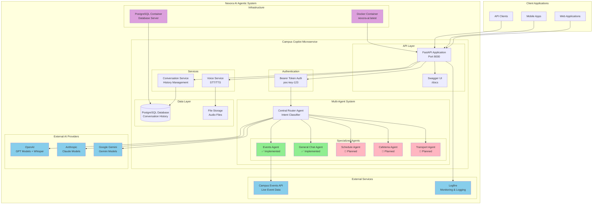

# Nexora AI Campus Copilot Microservice - Architecture Diagram

## Legend

- 🟢 **Green (Implemented)**: Currently functional components
- 🟡 **Pink (Planned)**: Future implementation per methodology
- 🔵 **Blue (External)**: Third-party services and APIs
- 🟣 **Purple (Infrastructure)**: Deployment and hosting components
