# Nexora AI Campus Copilot Microservice - Architecture Diagram

```mermaid
graph TB
    subgraph "Nexora AI Agentic System"
        subgraph "Campus Copilot Microservice"
            subgraph "API Layer"
                API[FastAPI Application<br/>Port 8000]
                DOCS[Swagger UI<br/>/docs]
                API --> DOCS
            end

            subgraph "Authentication"
                AUTH[Bearer Token Auth<br/>poc-key-123]
                API --> AUTH
            end

            subgraph "Multi-Agent System"
                ROUTER[Central Router Agent<br/>Intent Classifier]

                subgraph "Specialized Agents"
                    EVENTS[Events Agent<br/>✅ Implemented]
                    CHAT[General Chat Agent<br/>✅ Implemented]
                    SCHEDULE[Schedule Agent<br/>🚧 Planned]
                    CAFETERIA[Cafeteria Agent<br/>🚧 Planned]
                    TRANSPORT[Transport Agent<br/>🚧 Planned]
                end

                ROUTER --> EVENTS
                ROUTER --> CHAT
                ROUTER --> SCHEDULE
                ROUTER --> CAFETERIA
                ROUTER --> TRANSPORT
            end

            subgraph "Services"
                VOICE[Voice Service<br/>STT/TTS]
                CONV[Conversation Service<br/>History Management]
            end

            subgraph "Data Layer"
                DB[(PostgreSQL Database<br/>Conversation History)]
                STORAGE[File Storage<br/>Audio Files]
            end

            AUTH --> ROUTER
            API --> VOICE
            API --> CONV
            CONV --> DB
            VOICE --> STORAGE
        end

        subgraph "External AI Providers"
            OPENAI[OpenAI<br/>GPT Models + Whisper]
            ANTHROPIC[Anthropic<br/>Claude Models]
            GEMINI[Google Gemini<br/>Gemini Models]
        end

        subgraph "External Services"
            EVENTS_API[Campus Events API<br/>Live Event Data]
            LOGFIRE[Logfire<br/>Monitoring & Logging]
        end

        subgraph "Infrastructure"
            DOCKER[Docker Container<br/>nexora-ai:latest]
            POSTGRES[PostgreSQL Container<br/>Database Server]
        end
    end

    subgraph "Client Applications"
        WEB[Web Applications]
        MOBILE[Mobile Apps]
        API_CLIENTS[API Clients]
    end

    %% Connections
    WEB --> API
    MOBILE --> API
    API_CLIENTS --> API

    ROUTER --> OPENAI
    ROUTER --> ANTHROPIC
    ROUTER --> GEMINI

    EVENTS --> EVENTS_API
    API --> LOGFIRE

    DOCKER --> API
    POSTGRES --> DB

    %% Styling
    classDef implemented fill:#90EE90
    classDef planned fill:#FFB6C1
    classDef external fill:#87CEEB
    classDef infrastructure fill:#DDA0DD

    class EVENTS,CHAT implemented
    class SCHEDULE,CAFETERIA,TRANSPORT planned
    class OPENAI,ANTHROPIC,GEMINI,EVENTS_API,LOGFIRE external
    class DOCKER,POSTGRES infrastructure
```

## Legend

- 🟢 **Green (Implemented)**: Currently functional components
- 🟡 **Pink (Planned)**: Future implementation per methodology
- 🔵 **Blue (External)**: Third-party services and APIs
- 🟣 **Purple (Infrastructure)**: Deployment and hosting components
